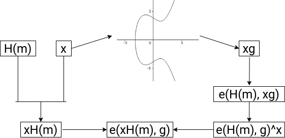

== DKG

=== Overview

Distributed Key Generation aims to solve the problem of getting n
parties able to cryptographically sign and verify signatures in the
presence of some number t attackers in a decentralized network. To do
so, this algorithm generates a public key, and a secret key of which no
single party knows, but has some share of.

=== Generating Contributions

Assume that there are n players P_1, P_2, …, P_n, and that the system
should be t-secure - that is, all honest players will succeed in
carrying out the algorithm in the case of at most t corrupted parties.

Each player randomly generates a secret polynomial P(x) of degree t,
whose constant coefficient is their secret key. Note that we choose
degree t, since t + 1 points are required to reconstruct P. The goal
here is to get other parties to agree that a player has a valid secret
key, in a way that reconstructing our secret key is impossible. To do
so, the player broadcasts a public polynomial P_g(x), which is generated
by mapping P(x)’s coefficients to points on an elliptic curve (that is,
for generator g and coefficient x, use xg). Then, they compute the
secret key contribution P(j) and send it to player j for j = 1, …, n. 

=== Verification and Complaints

Each player maps the outputs they receive onto points on the elliptic
curve, and checks it against the corresponding public polynomial’s
output. In this way, it is verified that the player has generated a
valid polynomial/output pair without exposing the polynomial itself.

If a player is unable to send their output to a recipient within a given
time frame, or the recipient computes the output to be invalid, the
recipient makes a complaint. Typically in DKG, the justification process
for the complaint may involve having the output in question broadcasted
to all players to verify for themselves. In SKALE’s implementation
however, we make use of the SKALE Manager which lives on the Ethereum
mainnet to compute/verify each output being complained about and slash
accordingly, and restart the DKG process. This has the added benefit of
giving economic incentive to act honestly, and is necessary because
unlike traditional DKG, there is a need to identify and replace all
malicious players.

=== Computing the public/private keys

Summing the public polynomials of all members results in the group’s
public polynomial, whose constant coefficient is the public key;
similarly, the sum of all secret polynomials results in the group’s
secret polynomial. If each player sums the secret key contributions they
received, they get an output of the sum of all player’s secret
polynomials - or, an output of the group’s secret polynomial. This is
their secret key share.

Note that the group’s secret key is created by the sum of all players’
polynomial’s constant values, and that given enough secret key shares (t
+ 1), we can reconstruct the the group’s secret key by recreating the
group’s private polynomial by way of interpolation.

The following is a visual representation of the entire process made with
Manim.

image::images/Poly.gif[Poly]

image::images/Verify.gif[Verify]

== BLS Signatures

=== Theory

BLS relies on the existence of an efficient bilinear pairing e: G x G ->
G_T for some elliptic curve G and finite field G_T, where the discrete
log problem is hard on G, and whose details are technical and are
therefore left out. The bilinearity condition gives us that e(ag, bg) =
e(g, g)^\{ab}.

Note that through this mapping, we can solve the decisional
Diffie-Hellman problem; that is, given xg, yg, and zg for generator g,
check that xy = z. Using our pairing, we can write e(xg, yg) = e(g,
g)^\{xy} = e(g, xyg), which we can compare with e(g, zg). However,
finding the actual values of x, y, and z are hard due to the discrete
log problem.

=== Signatures and Properties

We can take advantage of the pairing’s properties to generate fast,
compact, and aggregatable signatures.

Firstly, the verification and signing process is very straightforward.
Given a private key x and public key xg, suppose we wish to generate a
signature for message m. First, we generate the hash of the message H(m)
which is on the curve G, and publish xH(m). Then, verification is of the
form e(xH(m), g) = e(H(m), xg), which is true by the bilinearity
condition.

Now suppose we wish to verify multiple signatures for a single message.
By the properties of our mapping, we know that e(A, B + C) = e(A, B) *
e(A, C). Using this property, we can efficiently verify all by first
obtaining the sum of the signatures S, then verifying that e(g, S) = the
product of all (e(H(m_i), x_ig)). When taking this into account with the
fact that BLS signatures are very short (roughly half the bits of DSA or
ECDSA for similar security), BLS signatures for multiple parties save a
lot of storage and computation by only needing to store and verify one
value.

=== Significance with DKG

Pairing DKG and BLS has a lot of nice properties. First of all, through
DKG, we are actually able to generate and distribute usable BLS keys.
Secondly, the way DKG’s distributed secret shares and BLS’s signing
algorithm interact is efficient.

Suppose we run DKG, resulting in the group’s secret polynomial being
f(x), and secret key shares thus being f(i) for i . Note that we wish to
keep f(i) values secret, otherwise, f(x) can be created via polynomial
interpretation. Now, we generate signatures H(m)^f(i), and if we attain
at least t signatures, we can run polynomial interpolation in the
exponent to gain H(m)^f(0). In this way, we have generated a signature
that is equivalent to a signature generated by the group’s private key -
that is, as if it was signed by f(0) in the first place - in an
efficient manner and without having exposed any secret key shares.

=== Polynomial Interpolation

There are several methods of executing polynomial interpolation in the
exponent. In our purposes, we choose to implement an O(t^2) algorithm,
since it is actually faster than otherwise more efficient algorithms in
our use case with smaller numbers.

To do so, we use Lagrange polynomials. The key idea is that given points
(i, y_i) for i from 1 to t, we wish to express our final polynomial p(x)
as the sum of y_i * L_i(x), where we set up the Lagrange polynomial
L_i(x) to output 1 if its input is i, and 0 if its input is j from 1 to
t for j not equal to i. In this way, p(x) is a polynomial that hits all
of our desired points.

Mathematically, we let L_i(x) be

[latexmath]
++++
\[
\prod_{1 \leq k \leq t, k \not= i} \frac{x - k}{j - k}.
\]
++++
For our purposes, we only need to compute L_i(0), and to extrapolate
p(0), we raise it to the power; that is,

[latexmath]
++++
\[
\prod_{1 \leq k \leq t} ((H(m)^{s_k})^{L_k(0)} = H(m)^s,
\]
++++
for secret shares s_k and group secret s = p(0).

== Known Attacks

=== Joint-Feldman Protocol / Output Manipulation

In our DKG implementation, we choose to use the Joint-Feldman protocol.
In its traditional form, this protocol is vulnerable to an attack in
which one malicious player purposefully generates outputs which receive
complaints, which a secondary malicious player can then use the
broadcasted information to generate their polynomial in such a way that
biases the final result’s random distribution. However, since our
implementation verifies complaints through SKALE Manager, we do not have
such an issue since no information is exposed.

Furthermore, because our well-formed check for points on the elliptic
curve does not check that points are actually of our desired subgroup,
there exists another attack in theory which involves the addition of
elements of a different subgroup to submitted secret key shares. In this
way, there is a chance with t - 1 malicious players that the generated
public key is unusable. Again, however, our use case makes this attack
unfeasible, since the smallest subgroup of the elliptic curve we are
using is of order 10069, and we have much less players than that order,
which makes the attack impossible.

Thus, the Joint-Feldman protocol makes sense for us to use since it is
more lightweight than otherwise more secure DKG algorithms.

=== Front-Running Attack

SKALE Manager was previously vulnerable to a front-running attack for
which a malicious node would not send any data, then at the moment the
receiver rightfully complains about a lack of data, the node would
front-run the data. At this point, SKALE Manager would see the
receiver’s complaint as incorrect, and therefore slash the honest node.
This has been resolved by adding strict time slots for broadcasting and
complaining, and future threshold encryption will add further
protection.
