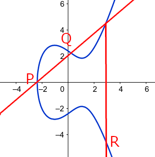
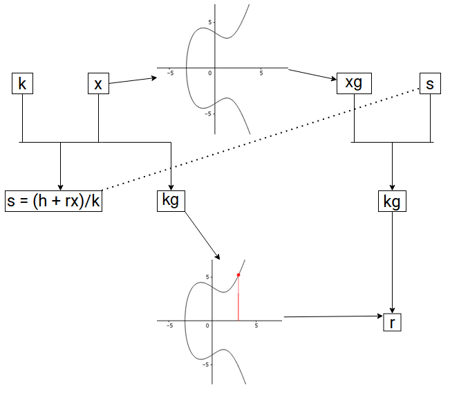

== Intro to Elliptic Curve Cryptography

In this document, we introduce the fundamental math behind elliptic
curves, and the ideas behind how this math can be used in cryptography.
Then, we walk through elliptic curve signatures, and explain the
significance behind BLS signatures.

=== One-way Functions and Private/Public Keys

One of the big ideas of cryptography is that there are certain
``one-way'' functions which, given an input, is easy to compute an
output for, but is much more difficult to do the reverse. These allow us
to transfer information securely. As a basic example, suppose I had a
bucket of blue paint. Then, one such function might take an input in the
form of a bucket of paint of some color, and mixing it with the blue
paint. It’s easy for me to do so and create an output of a different
color, but it will be hard to take this output and separate the two
paints.

This is where elliptic curves come in. An elliptic curve is an equation
of the form y^2 = ax^3 + bx + c.

Note that the curve is symmetric about the x-axis due to the y^2 term.
Given two points P, Q on such a curve, the line crossing through them is
guaranteed to hit a third point on the curve. In the edge case that this
line is vertical, we say that there is a point at infinity at which all
vertical lines intersect, and in the case that P = Q, we take the
tangent line, which will again only intersect the curve one more time.
If we take this third point and reflect it over the x-axis to get R, and
define P + Q = R according to this process, then + is a group operation
on this elliptic curve.

Being a group operation means that this binary operation satisfies
certain properties; namely, (a + b) + c = a + (b + c), there exists an
identity element P (in our case, the point at infinity) that satisfies P
+ a = a + P = a (think adding zero), and for every element a, there is
an inverse element -a, such that a + (-a) = P. To put it simply, we can
use + in similar ways as regular addition.

What this means for us is that we can create an especially nice one-way
function. First, we’ll take the points on an elliptic curve modulo a
prime; then, we’ll choose a generator g, which, when added to itself
enough times, runs through all points; then, given an input of integer
x, we’ll define our output as g + g + … + g = xg.

If you recall our operation, xg is just straightforward algebra to
compute. We can speed it up greatly by thinking about x in binary; that
is, to compute 12g for example, we compute 2g, then 4g, 8g, and finally
12g. This is allowed by group properties.

Yet, given xg and g, it becomes extremely hard to compute x. In fact, we
can’t do that much better than just multiplying g over and over and
hoping we get xg. This is called the elliptic curve discrete logarithm
problem (ECDLP).

Thus, it makes sense for one to create a secret key x, and set their
public key as xg. In this way, no one can compute the secret key given
the public key. However, as we’ll see later on, we can use the secret
key to show others that we know the secret key, without actually showing
the secret key; in other words, securely prove our identity. Due to how
secure ECDLP is, the amount of valuable resources saved by how efficient
and compact elliptic curves can be compared to other systems, and other
algebraic properties of this curve that become important in the upcoming
algorithms, ECC has become the method of choice by most
cryptocurrencies.

=== Elliptic Curve Signatures

==== ECDSA

To see how ECC is implemented, let’s look at the problem of signatures.
We want to create a method so that a person can generate signatures
which can be used to verify that person’s consent, but it must be so
that everybody else can verify that the signature did indeed come from
that person, and it must be infeasible (such as being equivalent to
solving ECDLP) to replicate another person’s signature.

To get an idea of how this is possible, consider using your secret
information to generate some kind of output, and publishing enough
information so that one can compute the same output in a different
manner using the published information; however, having the secret
information be unrecoverable given the published information. In this
way, we can use this output and published information as a signature, so
that others can use this computation to verify it, without knowing the
secret information used to create it in the first place.

In the Elliptic Curve Discrete Signature Algorithm (ECDSA)’s case,
suppose we wish to sign a message with secret key x and public key xg.
First, we generate a random number k and compute R = kg, and let r be
the x-coordinate of this point. Then, for a hashed message h, we compute
s = (h + rx) / k mod p. Our signature is (r, s).

The main idea outlined before is present here; using this secret k, we
created R = kg, which can be computed in two different ways. To see
this, for verification, we use the published information h, r, s, and
xg. Then, we compute P = (h/s)g + (r/s)xg = (h + rx)g/s = kg = R.
Finally, using R, we can recover the x-coordinate r, and verify it is
indeed in (r, s). Although verification is straightforward, to replicate
the signature (r, s) is infeasible without knowledge of k and x.

==== BLS Signatures

However, in the case that multiple signatures are required, there arises
an issue of computation and space. Specifically, suppose we wanted to
collect several signatures from different nodes for some message. Then,
we must collect each individual’s signature, and verify them one-by-one.
Boneh-Lynn-Shacham signatures solves this issue. This algorithm still
follows the main idea outlined before; however, by using properties
unique to elliptic curves (whose details are omitted for the sake of
brevity, but available in the DKG/BLS documentation), we are able to
generate quickly computable, compact, and aggregatable signatures. That
is, given signatures s_1, s_2, …, s_n, we can combine them together to
generate an aggregated signature s_(n+1) of the same size. We only need
to store and verify this single signature to check that all n signatures
are valid.

Other advantages include being deterministic, so we do not run into the
issue of having the same signature that may be present in ECDSA, and
being significantly more compact for the same level of security in the
case of just one signature as compared to signatures seen in ECDSA, RSA,
etc. Hence, in use cases where space and computation are expensive, BLS
signatures become advantageous. To see further details of BLS, see the
DKG/BLS documentation.
